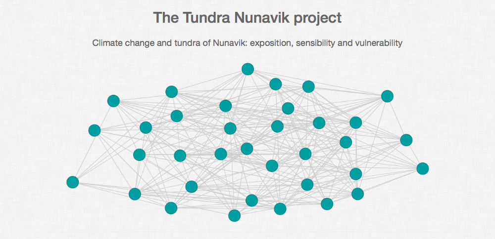

# bioclimaticatlas

A R Shiny application to display results of the Tundra Nunavik project.



This repository contains the complete code for running in a localhost machine the following app [https://ahasverus.shinyapps.io/bioclimaticatlas/](https://ahasverus.shinyapps.io/bioclimaticatlas/).

To download the code, click on the green button **Clone or Download** or use git if you know it.

Before running this app, please install the following R packages:

- `leaflet`
- `shiny`
- `shinyjs`
- `sp`
- `rgdal`
- `raster`
- `rgeos`
- `Cairo`
- `RColorBrewer`

To locally launch this app, type the following command lines in the R console:

```r
library(shiny)
setwd("path/to/the/app/folder")
runApp()
```
